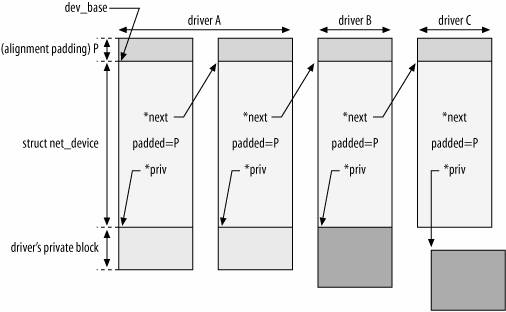
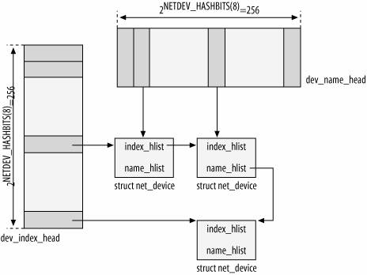
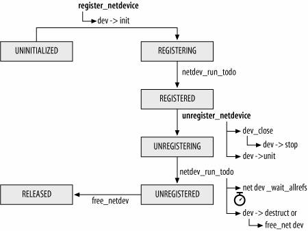
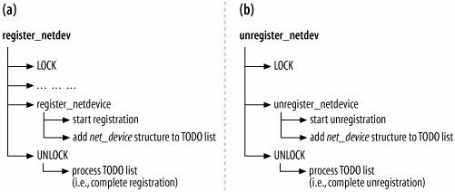

Chapter 8. Device Registration and Initialization

 - 8.1 When a Device Is Registered
    - Loading an NIC's device driver
    - Insert a hot-pluggable network device
 - 8.2 When a Device Is Unregistered
    - Unloading an NIC device driver
    - Remove a hot-pluggable network device
 - 8.3 Allocating net_device Structures
    - Size of private data structure
    - Device name
    - Setup routine
 - 8.4 Skeleton of NIC Registration and Unregistration

 Device registration model; (b) device unregistration model")

* 8.5 Device Initialization

  | Initializer                   | Function pointer name                                        | Variable name                                                |
  | ----------------------------- | ------------------------------------------------------------ | ------------------------------------------------------------ |
  | XXX_setup                     | change_mtu<br />set_mac_address<br />rebuild_header<br />hard_header<br />hard_header_cache<br />header_cache_update<br />hard_header_parse | type<br />hard_header_len<br />mtu<br />addr_len<br />tx_queue_len<br />broadcast<br />flags |
  | Device driver's probe routine | open<br />stop<br />hard_start_xmit<br />tx_timeout<br />watchdog_timeout<br />get_stats<br />get_wireless_stats<br />set_multicast_list<br />do_ioctl<br />init<br />uninit<br />poll<br />ethtool_ops (this is actually an array of routines) | base_addr<br />irq<br />if_port<br />priv<br />features      |

  * 8.5.1 Device Driver Initializations

  * 8.5.2 Device Type Initialization: xxx_setup Functions

    ```c
    void ether_setup(struct net_device *dev)
    {
        dev->change_mtu           = eth_change_mtu;
        dev->hard_header          = eth_header;
        dev->rebuild_header       = eth_rebuild_header;
        dev->set_mac_address      = eth_mac_addr;
        dev->hard_header_cache    = eth_header_cache;
        dev->header_cache_update  = eth_header_cache_update;
        dev->hard_header_parse    = eth_header_parse;
    
        dev->type                 = ARPHRD_ETHER;
        dev->hard_header_len      = ETH_HLEN;
        dev->mtu                  = 1500;
        dev->addr_len             = ETH_ALEN;
        dev->tx_queue_len         = 1000;
        dev->flags                = IFF_BROADCAST|IFF_MULTICAST;
    
        memset(dev->broadcast,0xFF, ETH_ALEN);
    }
    ```

  * 8.5.3 Optional Initializations and Special Cases

* 8.6 Organization of net_device Structures
  
  

  * 8.6.1 Lookups

* 8.7 Device State

  * 8.7.1 Queuing Discipline State
    * \_\_LINK_STATE_START
    * \_\_LINK_STATE_PRESENT
    * \_\_LINK_STATE_NOCARRIER
    * \_\_LINK_STATE_LINKWATCH_EVENT
    * \_\_LINK_STATE_XOFF
    * \_\_LINK_STATE_SHED
    * \_\_LINK_STATE_RX_SCHED
  * 8.7.2 Registration State
    * NETREG_UNINITIALIZED
    * NETREG_REGISTERING
    * NETREG_REGISTERED
    * NETREG_UNREGISTERING
    * NETREG_UNREGISTERED
    * NETREG_RELEASED

* 8.8 Registering and Unregistering Devices

  

  * 8.8.1 Split Operations: netdev_run_todo

    

  * 8.8.2 Device Registration Status Notification

    * 8.8.2.1 netdev_chain notification chain
      * NETDEV_UP
      * NETDEV_GOING_DOWN
      * NETDEV_DOWN
      * NETDEV_REGISTER
      * NETDEV_UNREGISTER
      * NETDEV_REBOOT
      * NETDEV_CHANGEADDR
      * NETDEV_CHANGENAME
      * NETDEV_CHANGE
    * 8.8.2.2 RTnetlink link notifications
      * multicast group RTMGRP_LINK with rtmsg_ifinfo