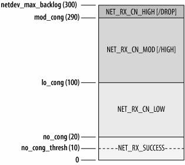

Chapter 9. Interrupts and Network Drivers

* 9.1 Decisions and Traffic Direction

  

* 9.2 Notifying Drivers When Frames Are Received

  

  * 9.2.1 Polling
  * 9.2.2 Interrupts
  * 9.2.3 Processing Multiple Frames During an Interrupt
  * 9.2.4 Timer-Driven Interrupts
  * 9.2.5 Combinations
  * 9.2.6 Example

* 9.3 Interrupt Handlers

  * 9.3.1 Reasons for Bottom Half Handlers

  * 9.3.2 Bottom Halves Solutions

    * Running context
    * Concurrency and locking

  * 9.3.3 Concurrency and Locking

  * 9.3.4 Preemption

    

  * 9.3.5 Bottom-Half Handlers

    * 9.3.5.1 Bottom-half handlers in kernel 2.2

      ```c
      enum {
              TIMER_BH = 0,
              CONSOLE_BH,
              TQUEUE_BH,
              DIGI_BH,
              SERIAL_BH,
              RISCOM8_BH,
              SPECIALIX_BH,
              AURORA_BH,
              ESP_BH,
              NET_BH,
              SCSI_BH,
              IMMEDIATE_BH,
              KEYBOARD_BH,
              CYCLADES_BH,
              CM206_BH,
              JS_BH,
              MACSERIAL_BH,
              ISICOM_BH
      };
      ```

    * 9.3.5.2 Bottom-half handlers in kernel 2.4 and above: the introduction of the softirq

      ```c
      enum
      {
          HI_SOFTIRQ=0,
          TIMER_SOFTIRQ,
          NET_TX_SOFTIRQ,
          NET_RX_SOFTIRQ,
          SCSI_SOFTIRQ,
          TASKLET_SOFTIRQ
      };
      ```

  * 9.3.6 Tasklets

    ```c
    struct tasklet_struct
    {
        struct tasklet_struct *next;
        unsigned long state;
        atomic_t count;
        void (*func)(unsigned long);
        unsigned long data;
    };
    ```

  * 9.3.7 Softirq Initialization

  * 9.3.8 Pending softirq Handling

    * 9.3.8.1 \_\_do\_softirq function

  * 9.3.9 Per-Architecture Processing of softirq

  * 9.3.10 ksoftirqd Kernel Threads

    * 9.3.10.1 Starting the threads

  * 9.3.11 Tasklet Processing

  * 9.3.12 How the Networking Code Uses softirqs

* 9.4 softnet_data Structure

  ```c
  struct softnet_data
  {
      int            throttle;
      int            cng_level;
      int            avg_blog;
      struct sk_buff_head    input_pkt_queue;
      struct list_head       poll_list;
      struct net_device      *output_queue;
      struct sk_buff         *completion_queue;
      struct net_device      backlog_dev;
  }
  ```

  * 9.4.1 Fields of softnet_data

    

  * 9.4.2 Initialization of softnet_data
